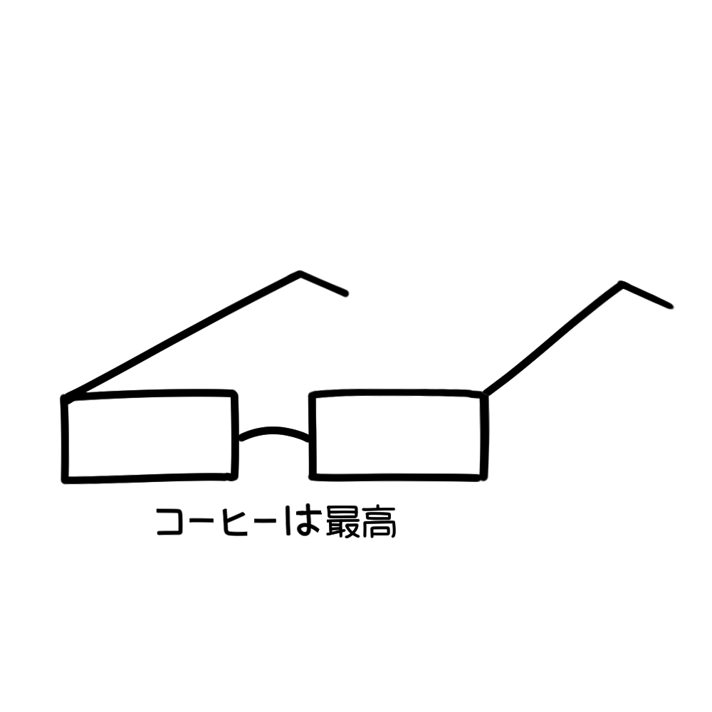

<!DOCTYPE html>
<html lang="en">
<head>
    <meta charset="UTF-8">
    <meta name="viewport" content="width=device-width, initial-scale=1.0">
    <title>Document</title>
    <link rel="stylesheet" href="test.css">
</head>
<body>
    <nav> 
        

            
        

        <ul>
            <li><a href="about.html">about</a></li>
            <li><a href="Contact.HTML">contact</a></li>
        </ul>
    </nav>

    <section class="art-yap">
        <h2>What Even *Is* Art?</h2>
        

            Art isn’t just paintings hanging in fancy galleries. It’s expression — pure emotion turned into shape, sound, color, or movement. 
            It’s the way people show what words can’t. A messy sketch, a moody playlist, a random photo that just *feels* right — that’s art too. 
        

        

            The cool thing is, there’s no rulebook. Art can be beautiful or weird, peaceful or chaotic. It can make you cry or make you confused — 
            and both reactions mean it worked. Because art isn’t about being understood by everyone; it’s about being *felt* by someone.
        

        

            At the end of the day, art is just us — humans — trying to make sense of life in the most creative ways we can.
        

    </section>

</body>
</html>
